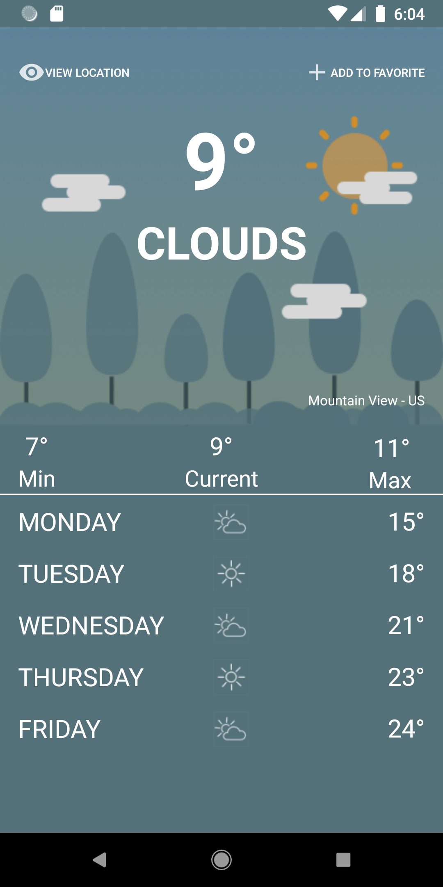
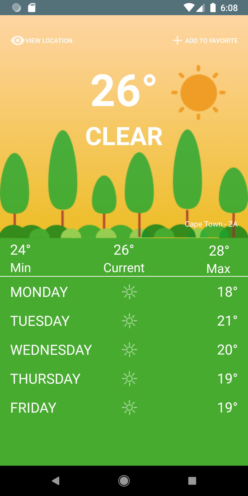
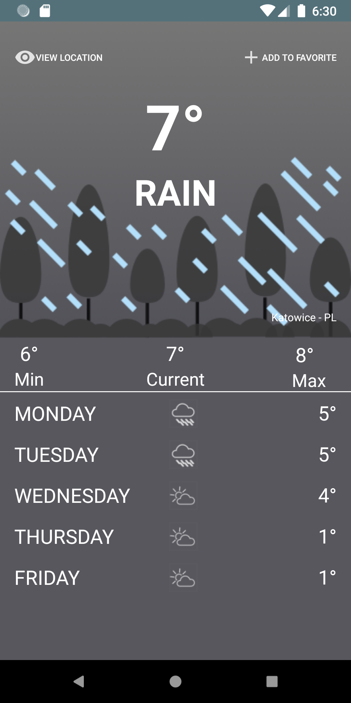

# WeatherApp
WeatherApp is an android app that is powered by openweathermap.org

## Change

https://openweathermap.org/current
https://openweathermap.org/forecast5

Those endpoints are no longer relevant on openweathermap.org.
The API has been updated the to v.2.5 and required
These are the links used:
### Current weather:
api.openweathermap.org/data/2.5/weather?lat={lat}&lon={lon}&units={units}&appid={apikey}

### 5 days forecast:
api.openweathermap.org/data/2.5/forecast?lat={lat}&lon={lon}&units={units}&appid={apikey}

The app presents an adaptive background depending on the weather of the current location.

## Illustrations
  

## Gif

